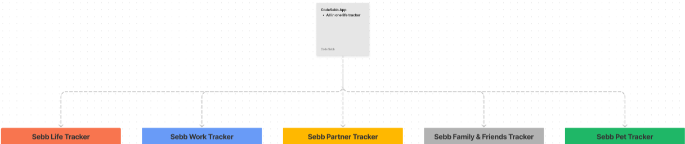
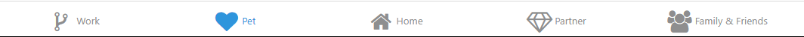

# My Life Tracker  

People's lives are complicated, intricate, and multi-faceted. This app aims to simplify life just a bit more for you.
Utilizing React-Native, API's, and a bit of TypeScript along the way, this soon-to-be mobile app will organize 5 key categories of your
life and centralize them under one app.  

<h2>Tools</h2> 
An app with this many moving parts and variety of features and components needs to be wireframed. For those new to engineering, 
wireframing is where you create previews of interactive features of your product(project) which helps create structure. This structure  
allows the creation process of the application to be less cluttered with a mess of different ideas and more clearly defines the requirements,  
checkpoints, and needs of the project.  

For this project, I've decided to utilize Figma as my wireframing and design tool. Figma is an incredibly versatile tool that can be utilized   
in creating beautiful UI/UX templates for your website(Hire me, Figma).   
Here, I created a basic flow chart of the specific features within the website(I will be breaking down more of each category as the project progresses): 

<h2>Tabs</h2>  

There are 5 tabs that signify a different aspect of your life:
<ul> 
  <li>You</li>
  <li>Work</li>
  <li>Relationship/Partner</li>
  <li>Friends/Family</li>
  <li>Pet</li>
</ul>  

<h2>You(Home)</h2> 
Yes, YOU! In order to have all the other categories, there first needs to be the foundational piece, which is you. With a built-in finance tracker, learning/habit builder, and self-care tracker. Each of these, along with their details will be shared soon.
